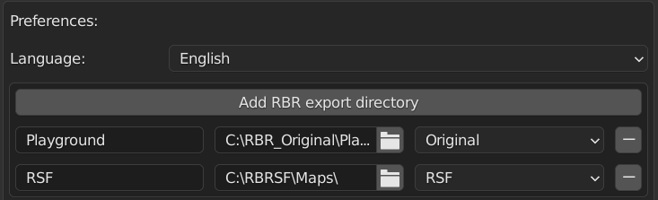
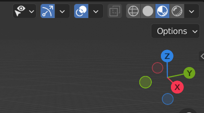
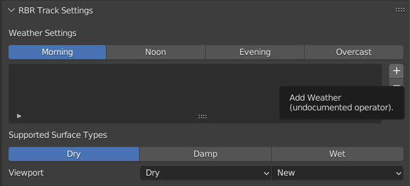
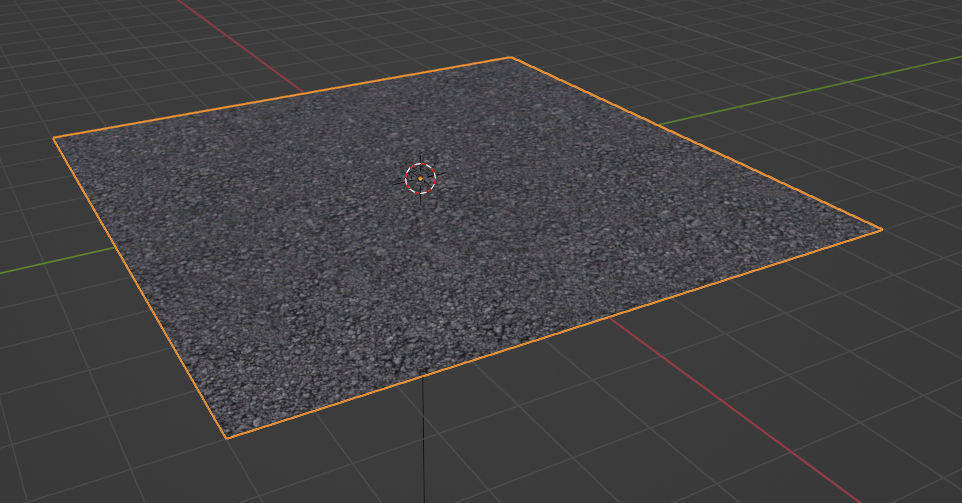
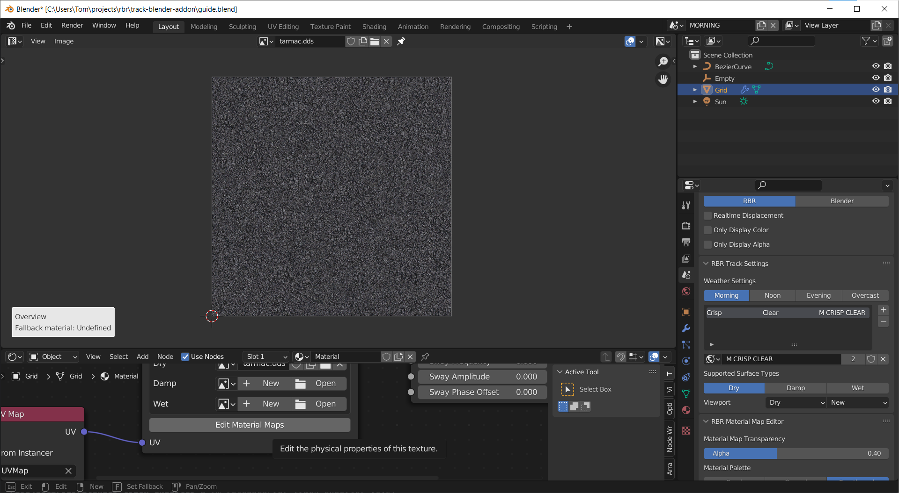

## blendRBR | [Home](index.md) | [Download](download.md) | Guide | [GitHub](https://github.com/RichardBurnsRally/blender-track-exporter/issues)

This is not a full track creation guide, just the very basics to get started
exporting stages to RBR. Eventually we'll have a full guide on best practices
and techniques, but until then it's expected that you already know what you're
doing or you can learn from others via the [track building
Discord server](https://discord.gg/VMySc2fPCH).

Note that since the addon is still in beta, things are subject to change.

## 0. Addon Setup

After installing the addon, you should set up your RBR export directories. Find
the RBR track addon in your list of addons in the blender preferences pane, and
at the bottom click "Add RBR export directory".



You can add as many as you like for different RBR installations. Name them
something suitable with the left hand field, and make sure the directory points
to the `Maps` directory of the RBR installation.

When you're done, save the preferences. If you just close the window without
saving, it won't work.


## 1. "Hello World"

We'll go over the minimum set of things you need to export your first track for
RBR. Naturally this will only use a couple of features (also known as RBR object
types), for a more comprehensive overview see [Features](features.md).

_This is not a blender tutorial - just a tutorial on how to export a track._

Create a new blend file and clear out any objects so you have a blank canvas.

## 1.1. Ground

Let's start by creating the ground mesh. Go to `Add > Mesh > Grid` to create a
simple flat ground plane, and scale it up by 10 so it's big enough to drive on.

In the object properties panel, find the section named "RBR Object Settings".
Change the type to "Geom Block", and enable "Generate Collisions". This is the
object type you should use for your ground mesh and buildings. Leave it set to
"Near".


Now we'll set up a simple textured material. Create a new material for your
object from the "Material Properties" panel. Open up the shader editor:


Remove the "Principled BSDF" shader node. For exporting to RBR, you must use the
shader nodes provided by the addon. `Add -> RBR Nodes -> RBR Shader` will add
the main shader node which you can use for any RBR object mesh, although not all
features are supported for all object types. Enable "Diffuse Texture 1" to use a
texture for this material.

Add an `RBR Texture` node, and click "New" to create a new RBR texture. Rename
it to something suitable, and connect your nodes up as such:


The RBR Texture node handles `dry/damp/wet` and `new/normal/worn` conditions.
`new/normal/worn` are available for textures marked as "Road Surface" - this can
only be used in diffuse texture slots, and it enables the texture image to vary
based on road condition. We'll just use dry for now. Select an image to use for
dry conditions. All textures must be DXT1/3/5 - we use DXT1 which is best for
opaque textures. The sizes of the texture must be a power of two, e.g. 512,
1024, 2048, etc - but it does not need to be square.

Switch to material preview mode to view what it will look like in game.



Your mesh will appear totally black - we're missing a couple of things! Switch
to the "Scene Properties" panel, and scroll down to find "RBR Track Settings".
This governs the supported surface types for your stage (`dry/damp/wet`) and the
weather settings supported by the stage. Click the `+` button to add a weather
type to the stage.



That will add a simple "crisp clear" weather. We'll leave everything as default
for now. The addon provides a real time preview which exactly matches the way
your stage will appear in game with the same weather settings. In the 3D editor
view, click `Add > Light > Sun`, and set the "RBR Object Type" to "Sun". The sun
direction will be taken from this object.

With that, your texture should now be visible on your object:



We're not quite done with the ground yet, we need to do physics mapping so the
addon knows what materials our mesh is made from. Open the UV or image editor in
one pane, and the shader editor beneath it. To physics map a particular texture,
click "Edit Material Maps" in the RBR texture node. The image will open up in
the image editor:



The controls of the material editor are displayed at the bottom of the screen.

From "Overview" mode, right click to start creating a new map. Note that the
controls at the bottom will update depending on the editor mode! In "Create New
Map" mode you can click and drag to define a new material map area. When you
release the button you'll be back in overview mode, where you can select your
map to resize and move it:


Tap the `X` key and the `Y` key to mark the map as repeating in X and Y
directions. This will lock the map to the texture dimensions, and allow the
addon to be smarter when exporting if your UV map does not fit within the
texture bounds. Tap `Tab` to enter material painting mode, then `T` to switch to
fill mode. Click anywhere within the map to fill the area with a material. By
default it's clean, dry tarmac, but you can pick the material from the scene
panel under the "RBR Material Map Editor" heading:


Tap `Esc` a few times to back out of the material map editor, and switch back to
the 3D viewport.

## 1.2. Driveline

Click `Add > Curve > Bezier` and set the "RBR Object Type" to "Driveline". This
curve defines the path the car is expected to take through the stage. It also
drives the pacenotes, which you can add in the "RBR Driveline Settings" panel in
the object properties pane. A few pacenotes are special events defining the
start line, two splits, the finish line, and the end of the stage. The end of
the stage will immediately end the stage when the car reaches it.

Scale the driveline curve up to fill the area. Make sure you apply the scale!
Add the special events and space them out along the driveline:


Technically these aren't needed just for quickly testing, but they are needed
for your stage to function correctly. Try to ensure the driveline covers from
_before_ the start of the stage until _after_ the end to avoid accidental penalties.

## 1.3. Car Location

Click `Add > Empty > Arrows` and set the "RBR Object Type" to "Car Location".
This is the place the car spawns when the stage is loaded. It should be slightly
behind the start line, or the driver will get a penalty when the stage starts.

The car spawns pointing along the `Y` axis of the arrows, with the rear axle
aligned with the `X` axis.

## 1.4. Export Settings

Go to the scene panel and find "RBR Export Settings". This is where you pick the
directory you want to export to, and give your stage an ID for testing. The ID
you choose depends on your installation, for me track 101 is free. RSF has
special rules around this, check their Discord.


With that, click "Export" and your stage should be created in your export
directory.

## 1.5. Testing

Actually driving the stage requires different steps depending on your RBR
installation. The addon writes `TrackSettings<track-id>.ini` file with your
track settings, which may need manually merging into your `TrackSettings.ini`
file. Similarly, you may need to add an entry to `tracks.ini` in order for your
track to show up in the list. Check the instructions for your RBR distribution.

My testing installation uses the Czech plugin, so I need to add this to
`tracks.ini`:

```ini
[Map101]
TrackName="Maps\track-101"
Particles="Maps\ps_british"
StageName="Blender Export Test"
Surface=0
Length=1.0
```

After that, launch your game, and drive your new stage!

## 1.6. Conclusion

Hopefully that gives you a quick overview of where to start with the track
exporter addon. I must emphasise that this is the _bare minimum_ needed to get a
stage to load in RBR. For a more comprehensive overview of object types see
[Features](features.md).
