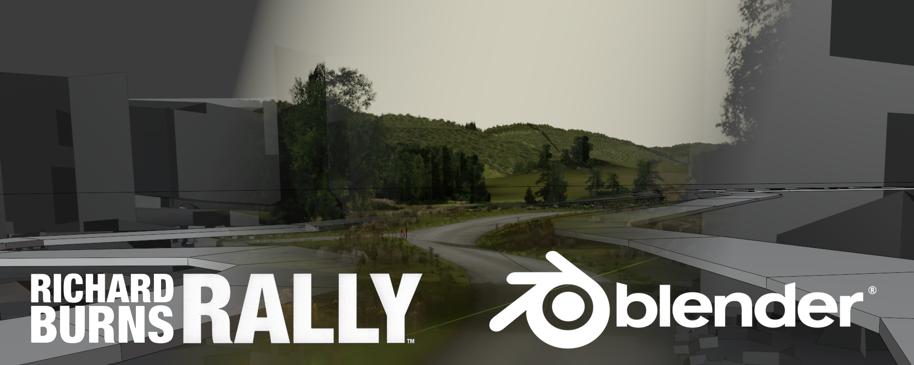

<title></title>
## Home | [Download](download.md) | [Guide](guide.md) | [Assets](assets.md) | [Errors](errors.md) | [GitHub](https://github.com/RichardBurnsRally/blender-track-exporter/issues)

This is a Blender addon for exporting tracks for Richard Burns Rally. The
ultimate goal is to understand and support every feature available in RBR, and
to supersede use of the custom tool Wallaby, which has a number of limitations.
Thank you to **Wally** for the creation of that tool, without it RBR would have
probably died by now.

Thanks to **WorkerBee** for his tireless reverse engineering efforts.
Without his help the development time would be several years longer.

Thanks to the many people who have tested the addon in the alpha stages, and
continue to give great feedback. In particular those who have been around from
the start: **Jan Kadeřábek**, **Joona Karimaa**, and **aesthetic\_sofa**.

I hope you enjoy using the addon to create new stages for RBR. There's still a
lot for me to do!
